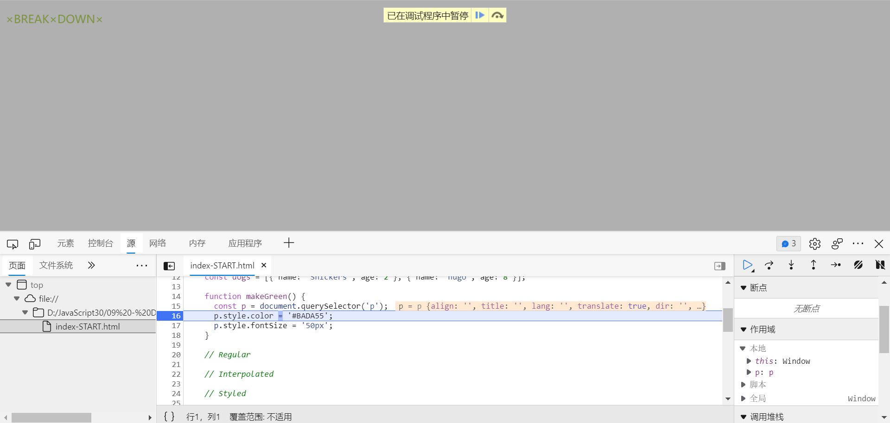

### Takeaway

In dev tools, right click the dom element you want to inspect, select `break on`, select `attributes modification`. When the attribute of the element changes, the console stops at the JS line that causes the change. In this way, we can know which line is actually working.

#### console.[xxx]
see code